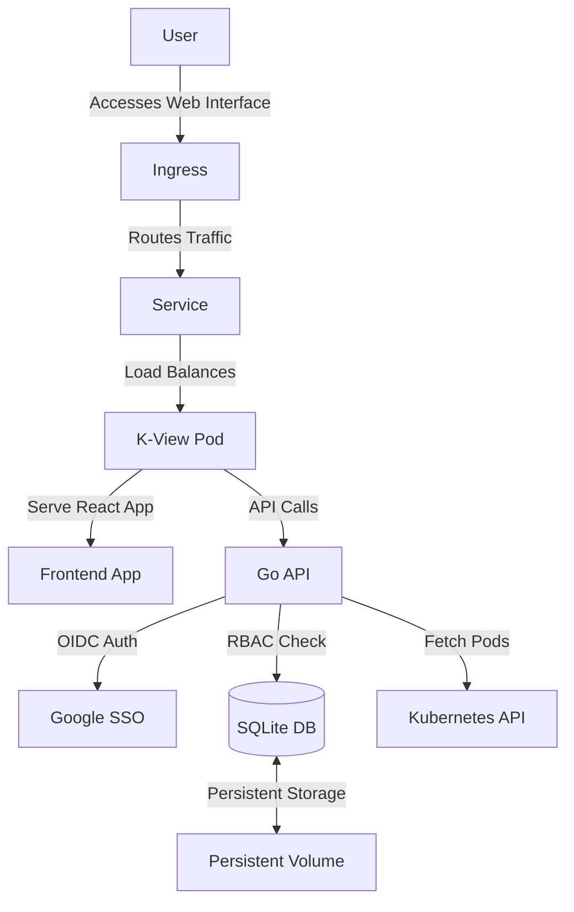

# K-View: Kubernetes Dashboard

K-View is a self-contained, secure Kubernetes dashboard written in Go and React, featuring Google SSO (OIDC) integration and internal RBAC using SQLite.

## Features

- **Backend**: Go (Gin framework) communicating with Kubernetes via `client-go`.
- **Frontend**: React + Vite, styled with Tailwind CSS for a modern dark theme.
- **Authentication**: Full Google SSO (OIDC) integration.
- **Internal RBAC**: SQLite-backed user-to-role mappings (Viewer / Admin).
- **Deployment**: Multi-stage Dockerfile and a robust Helm Chart for seamless Kubernetes deployment.

## Architecture



## Quick Start Guide

### 1. Local Setup and Build

Ensure you have Docker installed. Build the multi-stage image:

```bash
docker build -t k-view:latest .
```

### 2. Google SSO Configuration

1. Go to the [Google Cloud Console](https://console.cloud.google.com/).
2. Create a new project or select an existing one.
3. Navigate to **APIs & Services > Credentials**.
4. Create **OAuth 2.0 Client IDs** (Web application).
5. Add Authorized redirect URIs: `https://<YOUR_DOMAIN>/api/auth/callback` (or `http://localhost:8080/api/auth/callback` for local testing).
6. Note down the Client ID and Client Secret.

### 3. Helm Deployment

You can install K-View directly from the GitHub Container Registry (GHCR) using Helm OCI, without needing to clone the repository or build the image yourself.

```bash
helm install k-view oci://ghcr.io/oisis/charts/k-view --version main -n k-view --create-namespace
```

Alternatively, if you are developing locally, navigate to the `charts/k-view` directory, configure your `values.yaml` (especially the `oidc` secrets and ingress host), and install the local chart:

```bash
helm install k-view ./charts/k-view -n k-view --create-namespace
```

### 4. Internal RBAC Management

- By default, all authenticated users receive the `viewer` role.
- To assign an `admin` role (which grants access to the Admin Panel), you can either:
  1. Manually insert the role into the SQLite DB (e.g., by exec'ing into the pod).
  2. Use the Admin Panel (once an initial admin is set up).

**Example manual admin setup:**
```bash
kubectl exec -it <k-view-pod-name> -n k-view -- sqlite3 /data/kview.db "INSERT OR REPLACE INTO user_roles (email, role) VALUES ('your.email@gmail.com', 'admin');"
```