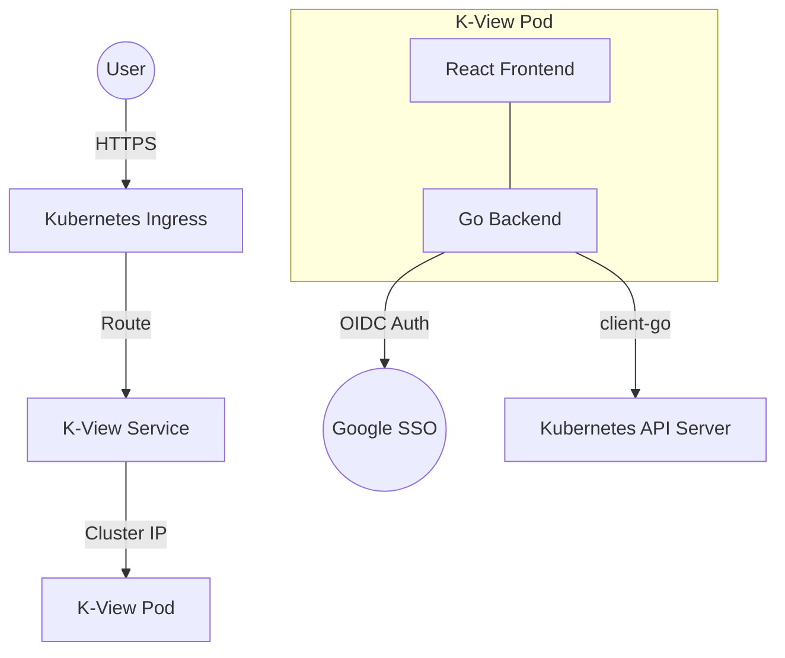

# Architecture

K-View is built with a focus on simplicity, portability, and security. It follows a classic client-server architecture tailored for Kubernetes environments.

## System Overview

### Backend (Go)
The backend is a stateless service written in Go using the **Gin** framework. 
- **Kubernetes Client**: Uses `client-go` to interact with the API Server. It supports both standard types (via `kubernetes.Clientset`) and arbitrary resources (via `dynamic.Interface`).
- **Auth**: Implements OAuth2/OIDC flow for Google SSO.
- **RBAC**: Enforces a declarative role-mapping system (`Viewer`, `Admin`, `SuperAdmin`) that translates to Kubernetes impersonation or direct service account permissions.
- **WebSocket/Terminal**: Provides an xterm.js-compatible terminal backend for `kubectl exec` and live logging.

### Frontend (React)
A modern, single-page application (SPA) built with **React** and **Vite**.
- **Theming**: A custom dark theme with **Glassmorphism** effects, managed via Tailwind CSS and CSS variables.
- **Visualization**: 
  - **Mermaid.js**: Used for the "Visual Trace" feature (Network Flow Diagrams).
  - **Recharts**: Powers the cluster metrics and usage charts.
- **Component Library**: Custom-built components for tables, modals, and resource management menus.

## Security Model
1. **Authentication**: Handled via Google SSO. No local user database.
2. **Authorization**: K-View uses its own internal assignments to determine a user's role.
3. **Impersonation**: Optionally, K-View can impersonate the authenticated user when talking to Kubernetes, ensuring that the dashboard honors the user's native cluster RBAC.
4. **Read-Only by Default**: The default service account permissions are restricted. Management actions (Delete, Restart, Scale) require explicit Admin roles and corresponding cluster permissions.
