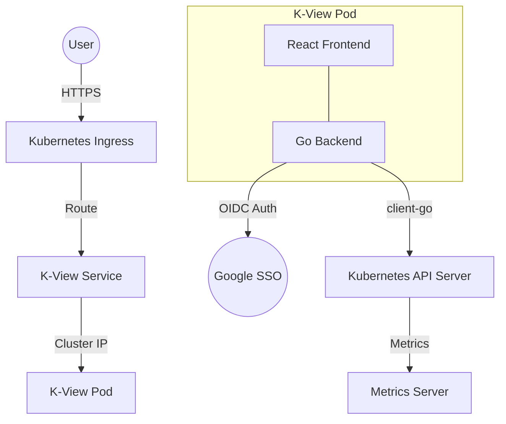

# Architecture

K-View is built with a focus on simplicity, portability, and security. It follows a stateless client-server architecture tailored for Kubernetes environments.

## System Overview

```mermaid
graph TD;
    User((User)) -->|HTTPS| Ingress[Kubernetes Ingress];
    Ingress -->|Route| SVC[K-View Service];
    SVC -->|Cluster IP| Pod[K-View Pod];
    
    subgraph "K-View Pod"
        FE[React Frontend] --- BE[Go Backend];
    end
    
    BE -->|OIDC Auth| Google((Google SSO));
    BE -->|client-go| K8s[Kubernetes API Server];
    K8s -->|Metrics| MS[Metrics Server];
```

### Backend (Go)
The backend is a stateless service written in Go using the **Gin Gonic** framework. 
- **Kubernetes Client**: Uses native `client-go` to interact with the API Server. It leverages `dynamic.Interface` to support all Kubernetes resources, including CRDs, without needing code changes.
- **Authentication**: Implements a secure OAuth2/OIDC flow integrated with Google SSO.
- **RBAC**: A declarative role-mapping system managed via `assignments.yaml` (injected via ConfigMap). It maps emails/groups to internal roles (`kview-cluster-admin`, `viewer`), which translate to Kubernetes impersonation.
- **WebSocket/Terminal**: Provides an xterm.js-compatible backend for `kubectl exec` and real-time log streaming.

### Frontend (React)
A high-performance single-page application (SPA) built with **React 18** and **Vite**.
- **User Interface**: Features a modern **Glassmorphism** aesthetic with a unified CSS variable system for themes.
- **Visualization**: 
  - **Mermaid.js**: Dynamically generates network flow diagrams (Ingress -> Service -> Pod).
  - **Recharts**: Visualizes real-time and historical cluster metrics (CPU/RAM/Pods).
- **Component Architecture**: Highly modularized with dedicated templates for each of the 27+ supported resource types.

## Development & Automation
The project emphasizes a "Shift Left" testing philosophy:
1. **Frozen Views**: A dedicated automated testing framework (`Vitest` + `React Testing Library`) ensures that resource lists and detailed views remain consistent.
2. **Unified Test Suite**: A complete set of 27 rozbudowane (complex) manifests in `/examples/test-suite` provides a predictable environment for UI verification.
3. **Scripts**: All lifecycle operations (Build, Test, Deploy) are consolidated in the `/scripts` directory using dynamic path resolution.

## Security Model
1. **Stateless**: No database is used. All state is derived from Kubernetes or OIDC.
2. **Impersonation**: K-View can impersonate the authenticated user, ensuring that Kubernetes-level RBAC is always honored.
3. **Auditability**: All console commands and management actions are performed using the identity of the logged-in user.
